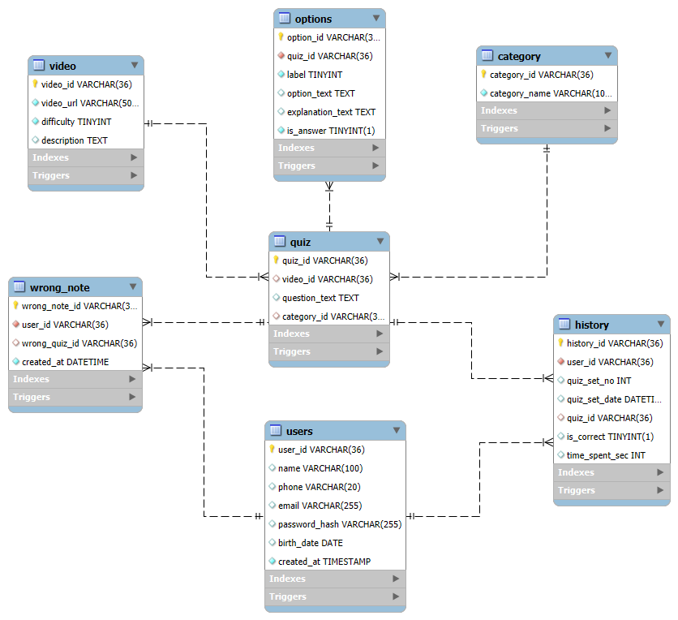

<h1> ai_go 데이터 베이스 개요</h1>

- 테이블에 대한 설명글임.

- 데이터베이스 초안으로 나중에 수정할 예정

 
 

 
 

- 파일 `Database_ai_go.sql`을 실행하면 데이터베이스(데모 데이터+트리거)가 생성됨.

---

 
 

# 테이블 정의

## `users` - 사용자 정보 (부모 테이블)
| 컬럼             | 타입           | NULL | 기본값                | 키      | 제약/추가정보                   | 코멘트          |
| -------------- | ------------ | ---- | ------------------ | ------ | ------------------------- | ------------ |
| user\_id       | varchar(36)  | NO   |                    | PK     | BEFORE INSERT에서 UUID 자동생성 | PK. 사용자 고유번호 |
| name           | varchar(100) | YES  |                    |        |                           | 사용자 이름       |
| phone          | varchar(20)  | YES  |                    |        |                           | 전화번호         |
| email          | varchar(255) | YES  |                    | UNIQUE |                           | 이메일(아이디)     |
| password\_hash | varchar(255) | YES  |                    |        |                           | 비밀번호         |
| birth\_date    | date         | YES  |                    |        |                           | 생년월일         |
| created\_at    | timestamp    | NO   | CURRENT\_TIMESTAMP |        |                           | 회원가입 시각      |

## 2. `video` — 학습 영상

| 컬럼          | 타입               | NULL | 기본값 | 키     | 제약/추가정보                   | 코멘트                 |
| ----------- | ---------------- | ---- | --- | ----- | ------------------------- | ------------------- |
| video\_id   | varchar(36)      | NO   |     | PK    | BEFORE INSERT에서 UUID 자동생성 | PK. 영상 고유번호         |
| video\_url  | varchar(500)     | NO   |     |       |                           | 영상 URL              |
| difficulty  | tinyint unsigned | NO   |     | CHECK | `BETWEEN 1 AND 3`         | 난이도 (상:1, 중:2, 하:3) |
| description | text             | YES  |     |       |                           | 도로 주행 상황 설명         |

---

## 3. `category` — 문제 유형 분류

| 컬럼             | 타입           | NULL | 기본값 | 키      | 제약/추가정보                   | 코멘트           |
| -------------- | ------------ | ---- | --- | ------ | ------------------------- | ------------- |
| category\_id   | varchar(36)  | NO   |     | PK     | BEFORE INSERT에서 UUID 자동생성 | PK. 카테고리 고유번호 |
| category\_name | varchar(100) | NO   |     | UNIQUE |                           | 카테고리명         |

---

## 4. `quiz` — 퀴즈(영상-퀴즈-문제)

| 컬럼             | 타입          | NULL | 기본값 | 키  | 제약/추가정보                                              | 코멘트           |
| -------------- | ----------- | ---- | --- | -- | ---------------------------------------------------- | ------------- |
| quiz\_id       | varchar(36) | NO   |     | PK | BEFORE INSERT에서 UUID 자동생성                            | PK. 퀴즈 고유번호   |
| video\_id      | varchar(36) | YES  |     | FK | 참조: `video(video_id)` / **ON DELETE CASCADE**        | FK → video    |
| question\_text | text        | YES  |     |    |                                                      | 문제 본문         |
| category\_id   | varchar(36) | YES  |     | FK | 참조: `category(category_id)` / **ON DELETE SET NULL** | FK → category |

---

## 5. `options` — 선지/정답/해설

| 컬럼                | 타입               | NULL | 기본값 | 키  | 제약/추가정보                                     | 코멘트         |
| ----------------- | ---------------- | ---- | --- | -- | ------------------------------------------- | ----------- |
| option\_id        | varchar(36)      | NO   |     | PK | BEFORE INSERT에서 UUID 자동생성                   | PK. 선지 고유번호 |
| quiz\_id          | varchar(36)      | NO   |     | FK | 참조: `quiz(quiz_id)` / **ON DELETE CASCADE** | FK → quiz   |
| label             | tinyint unsigned | NO   |     |    | **CHECK** `BETWEEN 1 AND 8`                 | 선지 번호       |
| option\_text      | text             | YES  |     |    |                                             | 선택지 내용      |
| explanation\_text | text             | YES  |     |    |                                             | 해설 내용       |
| is\_answer        | tinyint(1)       | NO   | 0   |    |                                             | 정답 여부(0/1)  |

---

## 6. `history` — 사용자 풀이 기록

| 컬럼               | 타입           | NULL | 기본값 | 키  | 제약/추가정보                                      | 코멘트              |
| ---------------- | ------------ | ---- | --- | -- | -------------------------------------------- | ---------------- |
| history\_id      | varchar(36)  | NO   |     | PK | BEFORE INSERT에서 UUID 자동생성                    | PK. 풀이 기록 고유번호   |
| user\_id         | varchar(36)  | NO   |     | FK | 참조: `users(user_id)` / **ON DELETE CASCADE** | FK → users       |
| quiz\_set\_no    | int          | YES  |     |    |                                              | 세트 번호 (한 세트=5문제) |
| quiz\_set\_date  | datetime     | YES  |     |    |                                              | 세트를 푼 날짜         |
| quiz\_id         | varchar(36)  | YES  |     | FK | 참조: `quiz(quiz_id)` / **ON DELETE CASCADE**  | FK → quiz        |
| is\_correct      | tinyint(1)   | YES  |     |    |                                              | 정오표기(1/0/NULL)   |
| time\_spent\_sec | int unsigned | YES  |     |    |                                              | 풀이 시간(초)         |

---

## 7. `wrong_note` — 오답 노트

| 컬럼              | 타입          | NULL | 기본값                | 키  | 제약/추가정보                                      | 코멘트            |
| --------------- | ----------- | ---- | ------------------ | -- | -------------------------------------------- | -------------- |
| wrong\_note\_id | varchar(36) | NO   |                    | PK | BEFORE INSERT에서 UUID 자동생성                    | PK. 오답 노트 고유번호 |
| user\_id        | varchar(36) | NO   |                    | FK | 참조: `users(user_id)` / **ON DELETE CASCADE** | FK → users     |
| wrong\_quiz\_id | varchar(36) | YES  |                    | FK | 참조: `quiz(quiz_id)` / **ON DELETE CASCADE**  | FK → quiz      |
| created\_at     | datetime    | NO   | CURRENT\_TIMESTAMP |    |                                              | 생성 시각          |

 
 

---

 
 

# 테이블 동작 규칙 : 트리거(자동 연동 관련)

## ⚡ 트리거: `trg_histupd_to_wrongnote_once`

: 사용자가 퀴즈를 틀리면 오답노트 테이블에 퀴즈id가 자동 등록됨

- **조건**  
  - `history.is_correct` 값이 **NULL/1 → 0(오답)** 으로 변경될 때
    - 즉, history(사용자기록) 테이블에서 is_correct(사용자의 정답 여부)열의 값이 null/1(없거나 정답) -> 0(오답)으로 바뀌면 트리거 작동  

- **동작**  
  - `wrong_note` 테이블에 `(user_id, quiz_id)` 자동 추가
    - wrong_note 테이블에 사용자 id와 틀린 문제의 퀴즈id가 자동 추가됨.

- **구현 방식**  
  - `INSERT IGNORE` 사용 → 중복 시 무시 (단, **UNIQUE 인덱스**가 있어야 확실히 중복 방지 가능)
    - 만약 같은 사용자가 같은 문제를 여러 번 틀린 경우 한 번만 기록(중복 무시)

---

 
 

## 트리거 세부 내용 

| 트리거명                            | 대상 테이블       | 타이밍/이벤트           | 실행 조건                                                                                                            | 수행 동작(결과)                                                                                                                             |
| ------------------------------- | ------------ | ----------------- | ---------------------------------------------------------------------------------------------------------------- | ------------------------------------------------------------------------------------------------------------------------------------- |
| `bi_users_uuid`                 | `users`      | **BEFORE INSERT** | `NEW.user_id IS NULL OR ''`                                                                                      | `SET NEW.user_id = UUID()`                                                                                                            |
| `bi_video_uuid`                 | `video`      | **BEFORE INSERT** | `NEW.video_id IS NULL OR ''`                                                                                     | `SET NEW.video_id = UUID()`                                                                                                           |
| `bi_category_uuid`              | `category`   | **BEFORE INSERT** | `NEW.category_id IS NULL OR ''`                                                                                  | `SET NEW.category_id = UUID()`                                                                                                        |
| `bi_quiz_uuid`                  | `quiz`       | **BEFORE INSERT** | `NEW.quiz_id IS NULL OR ''`                                                                                      | `SET NEW.quiz_id = UUID()`                                                                                                            |
| `bi_options_uuid`               | `options`    | **BEFORE INSERT** | `NEW.option_id IS NULL OR ''`                                                                                    | `SET NEW.option_id = UUID()`                                                                                                          |
| `bi_history_uuid`               | `history`    | **BEFORE INSERT** | `NEW.history_id IS NULL OR ''`                                                                                   | `SET NEW.history_id = UUID()`                                                                                                         |
| `bi_wrong_note_uuid`            | `wrong_note` | **BEFORE INSERT** | `NEW.wrong_note_id IS NULL OR ''`                                                                                | `SET NEW.wrong_note_id = UUID()`                                                                                                      |
| `trg_histins_to_wrongnote_once` | `history`    | **AFTER INSERT**  | `NEW.is_correct = 0` **AND** `NEW.quiz_id IS NOT NULL`                                                           | `INSERT IGNORE INTO wrong_note(user_id, wrong_quiz_id) VALUES (NEW.user_id, NEW.quiz_id)` — 오답 발생 시 즉시 오답 노트 1회 적재                    |
| `trg_histupd_to_wrongnote_once` | `history`    | **AFTER UPDATE**  | `NEW.is_correct = 0` **AND** `(OLD.is_correct IS NULL OR OLD.is_correct <> 0)` **AND** `NEW.quiz_id IS NOT NULL` | `INSERT IGNORE INTO wrong_note(user_id, wrong_quiz_id) VALUES (NEW.user_id, NEW.quiz_id)` — 정답/미풀이 → 오답으로 **변경된 경우**만 오답 노트 적재(중복 방지) |

 

---

 

